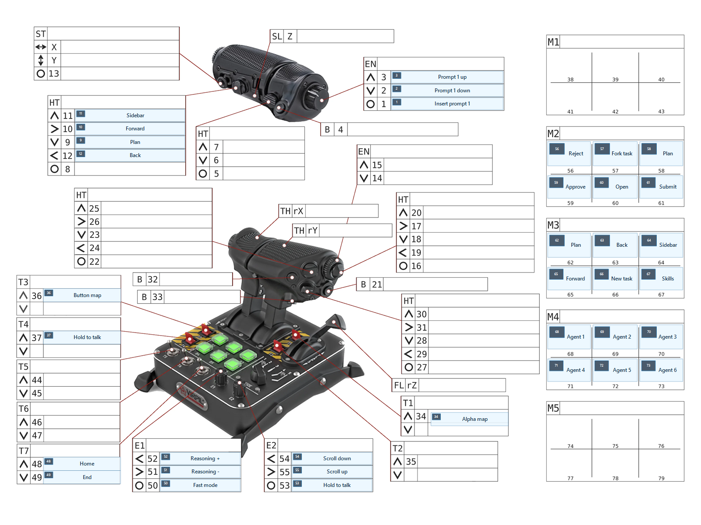
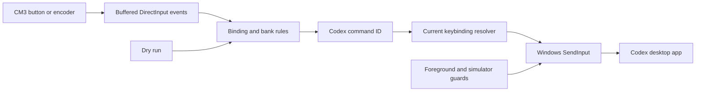
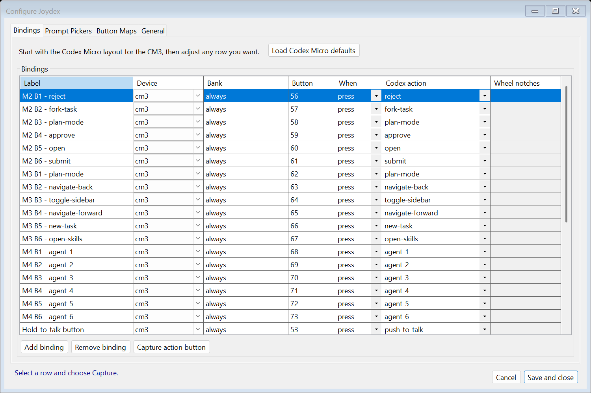
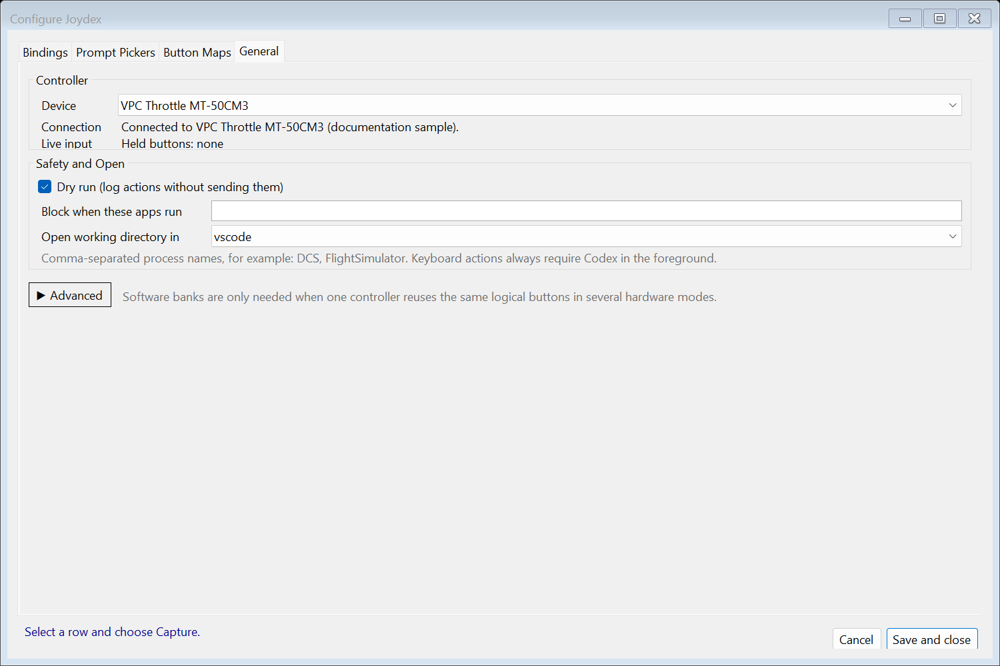
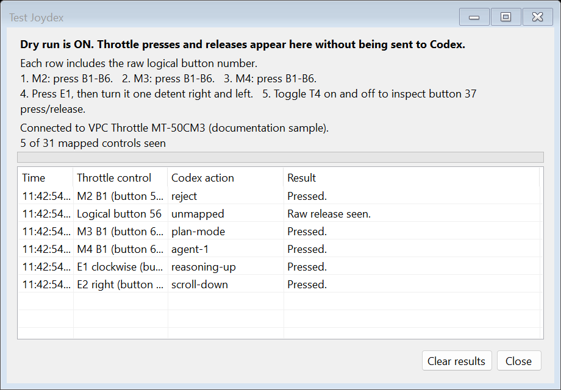
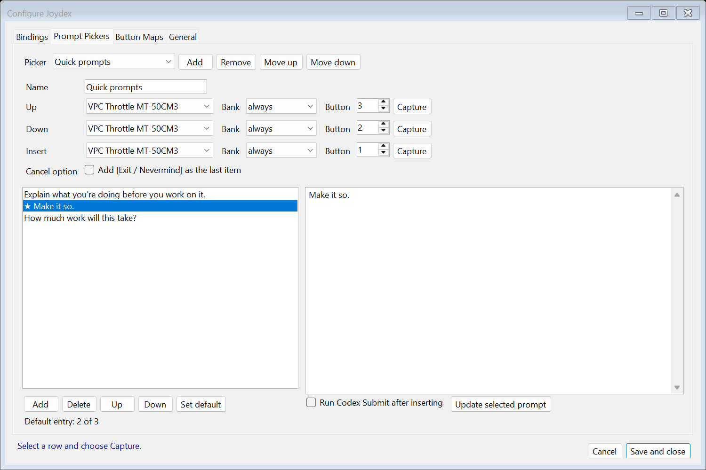
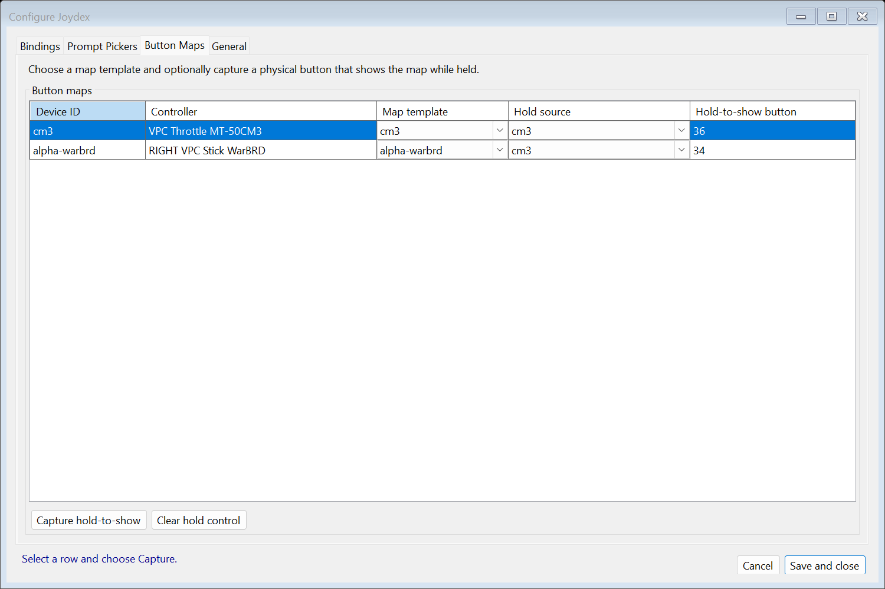
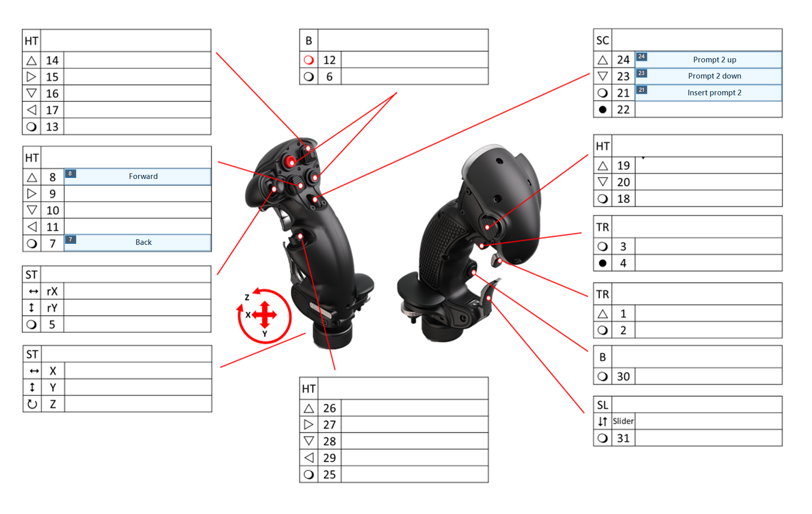

# Joydex

## Codex companion for a Joystick/Throttle
Why pay for a purpose-built Codex Micro keyboard when you already have a joystick, pad, or flight-sim throttle?

Just use Codex to set it up in a couple of hours and save yourself that extra $230.

## What is Joydex?
Joydex is a source example for turning a VIRPIL throttle into a physical control surface for the Codex desktop app. It reads the throttle through DirectInput, resolves the current Codex shortcuts, and injects the corresponding Windows input events. It is a small, self-contained Windows tray app.

It could be adapted pretty easily to other devices, but we wanted to show how easy it was to get going by using Codex itself to build the handlers. See [the case study](docs/CASE_STUDY.md) for the story of how this came together in just a few hours.

Nothing rocket-science, but we live in an era where you can retrofit your own hardware to a new workflow without having to buy yet-another-device. Hopefully this inspires you to do more hacking.

My favorite bit is I can just flip a T3 switch and see a floating map of the throttle's current bindings. The map reads its labels from the active configuration, so remapped controls are reflected in the floating window and I just flip the switch off and it instantly vanishes.



## What the experiment produced

Joydex runs as a Windows tray app and reads one or more controllers through background, non-exclusive DirectInput. It leaves controller firmware and VPC profiles alone. The included mapping uses the CM3's shifted button ranges to expose Codex controls across three dial positions, while device-qualified bindings can also use a Virpil Alpha/WarBRD or another attached controller.



Screenshot of the UI bindings, but you can also just ask Codex to configure them for you if you wanted. UI is so much easier when it's just some "oh hey set M2 B3 to reject" and your agent does the rest.



The configuration window keeps bindings, prompt pickers, button maps, and general settings on separate tabs. Software banks live under **General → Advanced** because they are only needed for hardware modes that reuse logical button numbers.



FWIW, the checked-in code demonstrates:

- Buffered joystick input, including encoder pulses that can begin and end between polling frames.
- Banked mappings for VIRPIL's five-way shift profile, where the dial changes the logical button range instead of emitting its own button event.
- A command catalog that resolves Codex's current shortcuts from `%USERPROFILE%\.codex\keybindings.json` immediately before dispatch.
- Chords, sequences, held push-to-talk modifiers, mouse-wheel actions, and safe cleanup of injected key state.
- Foreground-process and simulator guards around every dispatched action.
- Dry-run inspection, hot-plug recovery, configuration validation, and a floating hardware map.

## Codex building handlers for Codex

The first version could have hard-coded a table of function keys. That would have gone stale as soon as a shortcut changed. Joydex instead treats Codex command IDs as the durable interface. A physical control maps to an action such as `composer.submit` or `toggleSidebar`; the resolver then finds the user's current keybinding and turns it into a Windows input sequence.

This led to several concrete edge cases:

- A shortcut can be a chord, a multi-step sequence, a bare modifier used for push-to-talk, or explicitly unbound.
- Codex may rewrite `keybindings.json` while Joydex is reading it, so the resolver retries and retains its last valid snapshot.
- Prefix collisions can make two sequences ambiguous. Joydex detects those cases and blocks the action.
- Held keys need cleanup after disconnects, shutdown, partial injection failures, and rejected releases.
- A valid shortcut is still unsafe when Codex is in the background.

Those cases are covered in the test suite. The code remains small enough to trace from a DirectInput event through binding resolution to the final `SendInput` calls.



## Included CM3 layout

The starter profile follows the Codex Micro controls:

| CM3 control | Dial position | Role |
| --- | --- | --- |
| Base buttons B1-B6 | M2 | Reject, Fork, Plan, Approve, Open, Submit |
| Base buttons B1-B6 | M3 | Plan, Back, Sidebar, Forward, New task, Skills |
| Base buttons B1-B6 | M4 | Task slots 1-6 |
| Grip encoder EN (EN3/EN2/EN1) | Any | Prompt 1 up/down; push inserts selected or default prompt |
| Base encoder E1 | Any | Reasoning up/down; push toggles Fast mode |
| Five-way hat | Any | Plan, Forward, Sidebar, Back |
| Toggle T3 | Any | Hold the floating button map open |
| Toggle T1 | Any | Hold the Alpha/WarBRD button map open |

The floating map reads its labels from the active configuration, so remapped controls are reflected in the UI.

## Prompt pickers and multiple controllers

The tray's **Prompt pickers...** editor supports up to three named prompt lists. Each list has its own default entry and independently captured Up, Down, and Insert controls; those three controls can come from any configured DirectInput device. The first encoder detent opens the non-activating picker on its default, later detents wrap through the list, and Insert types at the current Codex caret. Each prompt can optionally run the resolved Codex Submit action immediately after insertion; this is off by default. A picker can also add **[Exit / Nevermind]** as its last item, which closes the overlay without typing or submitting. Escape or another controller button dismisses the picker.



Configured devices reconnect independently. Each supported device map has its own tray item, floating window position, and optional hold-to-show control from any configured controller. Configure it in **Configure Joydex → Button Maps**: select the target map row, choose its **Hold source**, click **Capture hold-to-show**, then move the control. The CM3 and Alpha/WarBRD maps can be visible at the same time.






## Build and explore the source

This is really more of a proof-of-concept that you can have Codex build a handler for this kind of thing instead of buying yet another custom device.

But if you want to build it, Joydex targets Windows and pins .NET SDK 8.0.423 in `global.json`.

```powershell
dotnet restore .\Joydex.sln
dotnet build .\Joydex.sln --configuration Release
dotnet test .\Joydex.sln --configuration Release --no-build
```

For a dry-run source session, copy the example configuration to a scratch path and pass it to the app project:

```powershell
$config = Join-Path $env:TEMP 'joydex-example.json'
Copy-Item .\config\joydex.example.json $config
dotnet run --project .\src\Joydex.App -- --config $config
```
The example configuration selects the throttle by product name and omits machine-specific DirectInput GUIDs. Its `dryRun` setting is enabled. Raw control events appear in the test window without being sent to Codex.

Use the tracer when adapting the example to another DirectInput profile:

```powershell
dotnet run --project .\tools\Joydex.Trace -- list
dotnet run --project .\tools\Joydex.Trace -- trace `
  --name "VPC Throttle MT-50CM3" `
  --seconds 60
```

Trace output uses one-based button numbers, matching `config.json`. Move one control at a time and test B1-B6 in every dial position.

## Repo map

| Path | Purpose |
| --- | --- |
| `src/Joydex.Core` | Configuration, input snapshots, bank rules, and binding engine |
| `src/Joydex.Windows` | DirectInput, Codex shortcut resolution, safety guards, and Windows input injection |
| `src/Joydex.App` | Tray lifecycle, configuration UI, dry-run inspector, and button map |
| `tools/Joydex.Trace` | DirectInput discovery and event tracing |
| `tests/Joydex.Tests` | Unit and Windows interop coverage |
| `config/joydex.example.json` | Safe, machine-neutral starter configuration |
| `docs/` | Case study, images, and planning notes |

## Versions and Config

Command IDs, Windows defaults, aliases, and precedence behavior were last checked on 2026-07-16 against OpenAI Codex package `26.707.12708.0`, bundled app `26.707.91948`, build `5440`.

Source builds use `%LOCALAPPDATA%\Joydex\config.json`, with `JOYDEX_CONFIG` and `--config` available for alternate paths. The graphical editor is the normal way to change mappings. The checked-in [example configuration](config/joydex.example.json) is intended for dry-run exploration and contains no device GUIDs.

## License and trademarks

The source code is available under the [MIT License](LICENSE). Attribution for the CM3 visual template is recorded in [Third-party notices](THIRD_PARTY_NOTICES.md).

Joydex is an independent project and is not affiliated with or endorsed by VIRPIL Controls, OpenAI, or Work Louder. VIRPIL, VPC, OpenAI, ChatGPT, Codex, Work Louder, and associated marks are the property of their respective owners.

## Likely asked questions

### Could I do this with Joystick Gremlin instead?

Oh sure, quite likely. [Joystick Gremlin](https://whitemagic.github.io/JoystickGremlin/) can read the CM3 and map its buttons to keyboard or mouse input. If you want a fixed set of Codex shortcuts on your own PC, Gremlin is a much faster way to get started.

Joydex is just a little more specific to the companion use case. It stores Codex command IDs and looks up your current shortcuts before it sends a key. It catches missing or conflicting shortcuts, releases held keys after a disconnect, and checks that Codex has focus. With a basic Gremlin profile, you would update the mapped keys by hand when your Codex shortcuts change. You would also pause the profile when you switch to another app.

Joydex talks straight to the throttle, so it does not need a virtual joystick. Gremlin's supported setup uses [vJoy](https://whitemagic.github.io/JoystickGremlin/introduction/installation.html) and gives you another profile to keep track of. If you use Gremlin for flight sims, you may already have all of that.

### I just want to try it in Gremlin. Any tips?

Start small. Create a fresh profile, open Gremlin's Input Viewer, and press B1-B6 once in every dial position. VIRPIL shift modes can report a different logical button number for the same physical button. Write those numbers down before you create any extra modes in Gremlin.

Next, map one normal button and one held control such as push-to-talk. Use the shortcuts shown in Codex Settings. Gremlin's [Map to Keyboard and Macro actions](https://whitemagic.github.io/JoystickGremlin/interface/actions.html) cover both cases. Once those work, fill in the rest of the throttle. Keep the profile paused while another app has focus; this quick setup will send its keys wherever you are typing.

Follow Gremlin's instructions for installing vJoy. You can skip HidHide at first because Codex does not read joystick input.

### Can it support the VIRPIL LEDs

Gremlin can drive them, but you need Python scripts, so it doesn't really buy you anything there. Joydex supports ten stable task slots: four primary slots on B1, B2, B4, and B5 across M2-M4, plus six overflow slots on B1-B6 on M1. Unoccupied M1 overflow slots are dark, and M5 stays command-only. Alert buttons open the assigned Codex task. Running and approval states remain assigned after navigation; completed and fault states return to their ordinary binding after a successful handoff.

Joydex sends one compact state snapshot to VIRPIL Controls LinkTool whenever a task or physical throttle bank changes. It reads M1-M5 through VIRPIL's read-only software-link feature report, so turning the mode dial automatically selects the matching LinkTool page. The generated profile gates primary rules to M2-M4, overflow rules to M1, and leaves M5 with baseline rules only. The Alpha remains global and shows the highest active state across all ten slots. The Task Alerts window includes current assignments, exact outgoing telemetry, and a recent hook-event stream for diagnosing delayed or missing status. See [the LED status research](docs/LED_STATUS_RESEARCH.md) for LinkTool setup, the hook design, safety behavior, and remaining hardware canaries.
