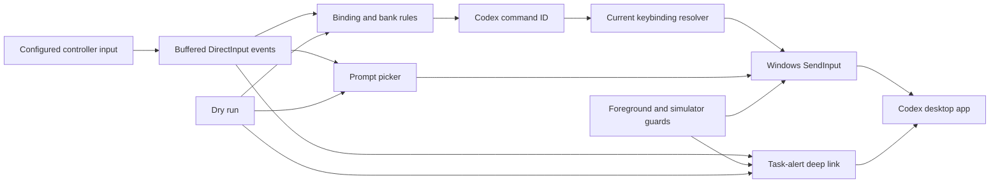
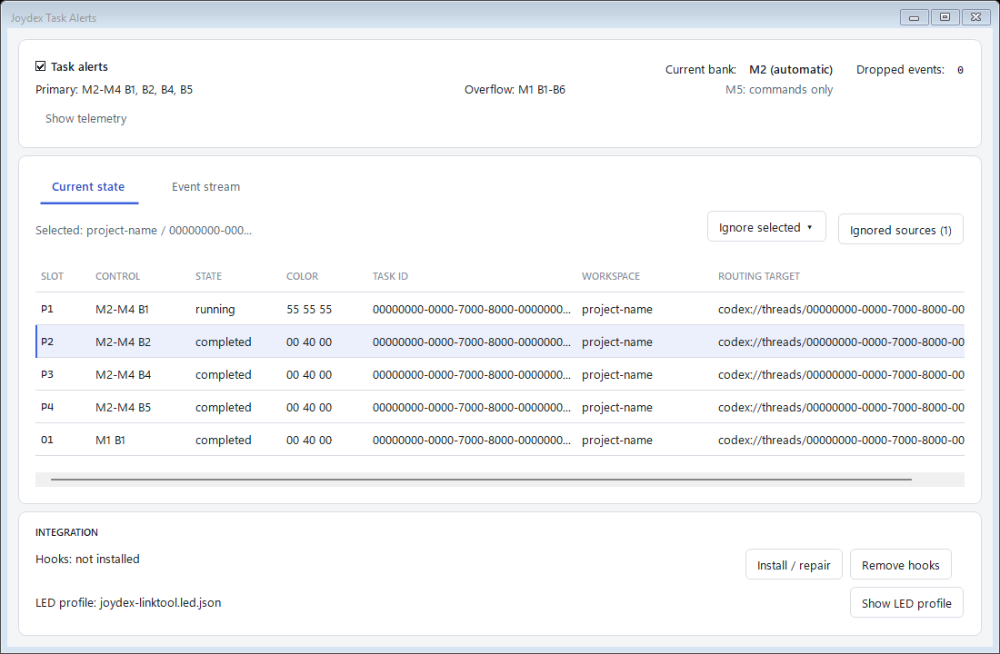

# Joydex

## Codex companion for a Joystick/Throttle
Why pay for a purpose-built Codex Micro keyboard when you already have a joystick, pad, or flight-sim throttle?

Just use Codex to set it up in a couple of hours and save yourself that extra $230.

## What is Joydex?
Joydex is a source example for turning a VIRPIL throttle into a physical control surface for the Codex desktop app. It reads the throttle through DirectInput, resolves the current Codex shortcuts, and injects the corresponding Windows input events. It is a small Windows tray app.

It could be adapted pretty easily to other devices, but we wanted to show how easy it was to get going by using Codex itself to build the handlers. See [the case study](docs/CASE_STUDY.md) for the story of how this came together in just a few hours.

Nothing rocket-science, but we live in an era where you can retrofit your own hardware to a new workflow without having to buy yet-another-device. Hopefully this inspires you to do more hacking.

My favorite bit is I can just flip a T3 switch and see a floating map of the throttle's current bindings. The map reads its labels from the active configuration, so remapped controls are reflected in the floating window and I just flip the switch off and it instantly vanishes.


## What the experiment produced

Joydex runs as a Windows tray app and reads one or more controllers through background, non-exclusive DirectInput. It leaves controller firmware and VPC profiles alone. The included mapping uses the CM3's shifted button ranges to expose Codex controls across three dial positions, while device-qualified bindings can also use a VIRPIL Alpha/WarBRD or another attached controller.



Screenshot of the UI bindings, but you can also just ask Codex to configure them for you if you wanted. UI is so much easier when it's just some "oh hey set M2 B3 to reject" and your agent does the rest.


The configuration window keeps bindings, prompt pickers, button maps, and general settings on separate tabs. Software banks live under **General → Advanced** because they are only needed for hardware modes that reuse logical button numbers.


FWIW, the checked-in code demonstrates:

- Buffered joystick input, including encoder pulses that can begin and end between polling frames.
- Banked mappings for VIRPIL's five-way shift profile, where the dial changes the logical button range instead of emitting its own button event.
- A command catalog that resolves Codex's current shortcuts from `%USERPROFILE%\.codex\keybindings.json` immediately before dispatch.
- Chords, sequences, held push-to-talk modifiers, mouse-wheel actions, and safe cleanup of injected key state.
- Foreground-process and simulator guards around every dispatched action.
- Dry-run inspection, hot-plug recovery, configuration validation, and a floating hardware map.

## Codex building handlers for Codex

The first version could have hard-coded a table of function keys. That would have gone stale as soon as a shortcut changed. Joydex instead treats Codex command IDs as the durable interface. A physical control maps to an action such as `composer.submit` or `toggleSidebar`; the resolver then finds the user's current keybinding and turns it into a Windows input sequence.

This led to several concrete edge cases:

- A shortcut can be a chord, a multi-step sequence, a bare modifier used for push-to-talk, or explicitly unbound.
- Codex may rewrite `keybindings.json` while Joydex is reading it, so the resolver retries and retains its last valid snapshot.
- Prefix collisions can make two sequences ambiguous. Joydex detects those cases and blocks the action.
- Held keys need cleanup after disconnects, shutdown, partial injection failures, and rejected releases.
- A valid shortcut is still unsafe when Codex is in the background.

Those cases are covered in the test suite. The code remains small enough to trace from a DirectInput event through binding resolution to the final `SendInput` calls.


## Included CM3 layout

The checked-in starter configuration follows the Codex Micro controls for a CM3 five-way shift profile:

| CM3 control | Dial position | Role |
| --- | --- | --- |
| Base buttons B1-B6 | M2 | Reject, Fork, Plan, Approve, Open, Submit |
| Base buttons B1-B6 | M3 | Plan, Back, Sidebar, Forward, New task, Skills |
| Base buttons B1-B6 | M4 | Agents 1-6 |
| Grip encoder EN (EN3/EN2/EN1) | Any | Prompt 1 up/down; push inserts selected or default prompt |
| Base encoder E1 | Any | Reasoning up/down; push toggles Fast mode |
| Five-way hat | Any | Plan, Forward, Sidebar, Back |
| Toggle T3 | Any | Hold the floating button map open |

The floating map reads its labels from the active configuration, so remapped controls are reflected in the UI. Additional controllers and their map controls can be added separately.

## Task-status LEDs

The LEDs turn the throttle into a ten-slot task monitor. Four primary tasks use B1, B2, B4, and B5 across M2-M4. Six overflow tasks use B1-B6 on M1, where every unassigned button stays dark. M5 remains available for ordinary commands. The Alpha grip LED shows the highest-priority state across all ten slots.

Dim gray means running, yellow means the task needs attention, and low green means completed. Red is reserved for a future fault source. Pressing an assigned button opens that Codex task. Running and attention states remain assigned after navigation; opening a completed task clears its slot and restores the button's normal binding.

### Quick start

1. Connect the CM3 throttle and Alpha grip, then start Joydex.
2. Open **Task alerts status...** from the Joydex tray. Choose **Show LED profile** and load the generated file in LinkTool.
3. Keep LinkTool's telemetry listener running on `127.0.0.1:4123`.
4. Choose **Install / Repair hooks**. Approve Codex's trust prompt if it appears, then confirm the window says `Hooks: installed`.
5. Leave **Task alerts** checked in the tray menu.



Joydex sends a complete snapshot whenever a task or physical mode changes, and LinkTool holds the matching colors. A read-only VIRPIL Software Link report tells Joydex which M1-M5 position is selected, so turning the dial switches LED pages without writing to controller firmware or profiles.

Task assignments, completion deadlines, and privacy-preserving attention hashes are saved in `%LOCALAPPDATA%\Joydex\task-alert-state.json`. Prompt text, commands, and tool responses are never stored there. Active slots survive a Joydex restart, expired entries are discarded during restore, and turning Task alerts off clears the saved assignments. The tray's **Task alerts status...** window installs or repairs the Codex hooks and shows current assignments, exact LinkTool telemetry, and the last 100 lifecycle events. See [the LED status guide](docs/LED_STATUS.md) for setup, troubleshooting, and the full behavior.

## Prompt pickers and multiple controllers

The tray's **Prompt pickers...** editor supports up to three named prompt lists. Each list has its own default entry and captured Up, Down, and Insert controls. The controls can come from any configured DirectInput device.

- The first encoder detent opens the non-activating picker on its default. Later detents wrap through the list.
- Insert types the selected prompt at the current Codex caret. A per-prompt option can run the resolved Codex Submit action afterward; it is off by default.
- **[Exit / Nevermind]**, Escape, or another controller button closes the picker without typing or submitting.


Configured devices reconnect independently. Each supported device map has its own tray item, floating window position, and optional hold-to-show control from any configured controller. Configure it in **Configure Joydex → Button Maps**: select the target map row, choose its **Hold source**, click **Capture hold-to-show**, then move the control. The CM3 and Alpha/WarBRD maps can be visible at the same time.

The checked-in [advanced configuration](config/joydex.advanced.example.json) is a sanitized copy of a working CM3 plus Alpha/WarBRD setup. It demonstrates two device profiles, cross-device map controls, two prompt pickers, custom task navigation, and two-notch scrolling. Its device GUIDs are removed and dry run is enabled. The prompt lists show one real workflow and are meant to be edited.


## Build and explore the source

This is really more of a proof-of-concept that you can have Codex build a handler for this kind of thing instead of buying yet another custom device.

But if you want to build it, Joydex targets Windows and pins .NET SDK 8.0.423 in `global.json`.

```powershell
dotnet restore .\Joydex.sln
dotnet build .\Joydex.sln --configuration Release
dotnet test .\Joydex.sln --configuration Release --no-build
```

For a dry-run source session, copy the complete CM3 starter configuration to a scratch path and pass it to the app project:

```powershell
$config = Join-Path $env:TEMP 'joydex-example.json'
Copy-Item .\config\joydex.example.json $config
dotnet run --project .\src\Joydex.App -- --config $config
```
The scratch path keeps this run separate from `%LOCALAPPDATA%\Joydex\config.json`. The starter selects the throttle by product name and omits machine-specific DirectInput GUIDs. It includes the bindings and prompt picker shown above with `dryRun` enabled, so raw control events and resolved actions appear in the test window without being sent to Codex.

To explore the two-controller version, copy `config\joydex.advanced.example.json` to the scratch path instead. Its broad `MT-50CM3` and `WarBRD` product-name selectors may need adjustment if more than one matching controller is attached.

Use the tracer when adapting the example to another DirectInput profile:

```powershell
dotnet run --project .\tools\Joydex.Trace -- list
dotnet run --project .\tools\Joydex.Trace -- trace `
  --name "VPC Throttle MT-50CM3" `
  --seconds 60
```

Trace output uses one-based button numbers, matching `config.json`. Move one control at a time and test B1-B6 in every dial position.

## Repo map

| Path | Purpose |
| --- | --- |
| `src/Joydex.Core` | Configuration, multi-device input models, bindings, prompt pickers, and task-alert state |
| `src/Joydex.Windows` | DirectInput, shortcut resolution and injection, safety guards, task links, hooks, and LinkTool output |
| `src/Joydex.App` | Tray lifecycle, configuration UI, dry-run inspector, prompt overlays, diagnostics, and button maps |
| `src/Joydex.HookRelay` | Native hook command that forwards Codex lifecycle events to Joydex |
| `src/Joydex.Guardian` | Crash cleanup for active task-status LEDs |
| `tools/Joydex.Trace` | DirectInput discovery and event tracing |
| `tests/Joydex.Tests` | Unit and Windows interop coverage |
| `config/joydex.example.json` | Safe, machine-neutral starter configuration |
| `config/joydex.advanced.example.json` | Sanitized two-controller working example |
| `docs/` | Case study, setup guides, research notes, and images |

## Versions and Config

Command IDs, Windows defaults, aliases, and precedence behavior were last checked on 2026-07-16 against OpenAI Codex package `26.707.12708.0`, bundled app `26.707.91948`, build `5440`.

Source builds use `%LOCALAPPDATA%\Joydex\config.json`, with `JOYDEX_CONFIG` and `--config` available for alternate paths. The graphical editor is the normal way to change mappings. Both checked-in example configurations are intended for dry-run exploration and contain no device GUIDs.

## Likely asked questions

### Could I do this with Joystick Gremlin instead?

Oh sure, quite likely. [Joystick Gremlin](https://whitemagic.github.io/JoystickGremlin/) can read the CM3 and map its buttons to keyboard or mouse input. If you want a fixed set of Codex shortcuts on your own PC, Gremlin is a much faster way to get started.

Joydex is just a little more specific to the companion use case. It stores Codex command IDs and looks up your current shortcuts before it sends a key. It catches missing or conflicting shortcuts, releases held keys after a disconnect, and checks that Codex has focus. With a basic Gremlin profile, you would update the mapped keys by hand when your Codex shortcuts change. You would also pause the profile when you switch to another app.

Joydex talks straight to the throttle, so it does not need a virtual joystick. Gremlin's supported setup uses [vJoy](https://whitemagic.github.io/JoystickGremlin/introduction/installation.html) and gives you another profile to keep track of. If you use Gremlin for flight sims, you may already have all of that.

### Can it support the VIRPIL LEDs?

Yes. Joydex's built-in task-status LEDs are described above. Gremlin can also drive VIRPIL LEDs through Python scripts if a fixed keyboard profile is a better fit.

## License and trademarks

The source code is available under the [MIT License](LICENSE). Visual-asset provenance and third-party attribution are recorded in [Third-party notices](THIRD_PARTY_NOTICES.md).

Joydex is an independent project and is not affiliated with or endorsed by VIRPIL Controls, OpenAI, or Work Louder. VIRPIL, VPC, OpenAI, ChatGPT, Codex, Work Louder, and associated marks are the property of their respective owners.
