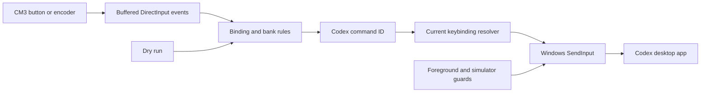

# Joydex

Joydex is a source example for turning a VIRPIL throttle into a physical control surface for the Codex desktop app. The project began with a practical experiment: give Codex hardware traces, a safety brief, and a test loop, then have it build the Windows keyboard handlers that drive its own interface.

The useful part of the example lives between the joystick and the keystroke. A short encoder pulse has to survive the polling loop. A physical button has to become a stable Codex command. The command has to follow the shortcut currently configured in Codex. Finally, the input must be blocked whenever another application has focus.


## What the experiment produced

Joydex runs as a Windows tray app and reads a VPC Throttle MT-50CM3 through background, non-exclusive DirectInput. It leaves the throttle firmware and VPC profile alone. The included mapping uses the CM3's shifted button ranges to expose Codex controls across three dial positions.



The code demonstrates:

- Buffered joystick input, including encoder pulses that can begin and end between polling frames.
- Banked mappings for VIRPIL's five-way shift profile, where the dial changes the logical button range instead of emitting its own button event.
- A command catalog that resolves Codex's current shortcuts from `%USERPROFILE%\.codex\keybindings.json` immediately before dispatch.
- Chords, sequences, held push-to-talk modifiers, mouse-wheel actions, and safe cleanup of injected key state.
- Foreground-process and simulator guards around every dispatched action.
- Dry-run inspection, hot-plug recovery, configuration validation, and a floating hardware map.

## Codex building handlers for Codex

The first version could have hard-coded a table of function keys. That would have gone stale as soon as a shortcut changed. Joydex instead treats Codex command IDs as the durable interface. A physical control maps to an action such as `composer.submit` or `toggleSidebar`; the resolver then finds the user's current keybinding and turns it into a Windows input sequence.

This led to several concrete edge cases:

- A shortcut can be a chord, a multi-step sequence, a bare modifier used for push-to-talk, or explicitly unbound.
- Codex may rewrite `keybindings.json` while Joydex is reading it, so the resolver retries and retains its last valid snapshot.
- Prefix collisions can make two sequences ambiguous. Joydex detects those cases and blocks the action.
- Held keys need cleanup after disconnects, shutdown, partial injection failures, and rejected releases.
- A valid shortcut is still unsafe when Codex is in the background.

Those cases are covered in the test suite. The code remains small enough to trace from a DirectInput event through binding resolution to the final `SendInput` calls.


## Included CM3 layout

The starter profile follows the Codex Micro controls:

| CM3 control | Dial position | Role |
| --- | --- | --- |
| Base buttons B1-B6 | M2 | Fast, Approve, Reject, Fork, Push-to-talk, Submit |
| Base buttons B1-B6 | M3 | Plan, Back, Sidebar, Forward, New task, Skills |
| Base buttons B1-B6 | M4 | Task slots 1-6 |
| Base encoder E1 | Any | Reasoning down/up; push unused |
| Five-way hat | Any | Plan, Forward, Sidebar, Back |
| Toggle T3 | Any | Hold the floating button map open |

The floating map reads its labels from the active configuration, so remapped controls are reflected in the UI.


## Build and explore the source

Joydex targets Windows and pins .NET SDK 8.0.423 in `global.json`.

```powershell
dotnet restore .\Joydex.sln
dotnet build .\Joydex.sln --configuration Release
dotnet test .\Joydex.sln --configuration Release --no-build
```

For a dry-run source session, copy the example configuration to a scratch path and pass it to the app project:

```powershell
$config = Join-Path $env:TEMP 'joydex-example.json'
Copy-Item .\config\joydex.example.json $config
dotnet run --project .\src\Joydex.App -- --config $config
```

The example configuration selects the throttle by product name and omits machine-specific DirectInput GUIDs. Its `dryRun` setting is enabled. Raw control events appear in the test window without being sent to Codex.

Use the tracer when adapting the example to another DirectInput profile:

```powershell
dotnet run --project .\tools\Joydex.Trace -- list
dotnet run --project .\tools\Joydex.Trace -- trace `
  --name "VPC Throttle MT-50CM3" `
  --seconds 60
```

Trace output uses one-based button numbers, matching `config.json`. Move one control at a time and test B1-B6 in every dial position.

## Repository map

| Path | Purpose |
| --- | --- |
| `src/Joydex.Core` | Configuration, input snapshots, bank rules, and binding engine |
| `src/Joydex.Windows` | DirectInput, Codex shortcut resolution, safety guards, and Windows input injection |
| `src/Joydex.App` | Tray lifecycle, configuration UI, dry-run inspector, and button map |
| `tools/Joydex.Trace` | DirectInput discovery and event tracing |
| `tests/Joydex.Tests` | Unit and Windows interop coverage |
| `config/joydex.example.json` | Safe, machine-neutral starter configuration |

## Safety boundaries

Every newly created configuration starts in dry-run mode. The input engine establishes a baseline after connecting and ignores settling values during a short warm-up. Cooldowns reject accidental repeats, while reasoning-encoder pulses bypass the cooldown so each detent reaches Codex.

Keyboard actions require ChatGPT or Codex to own the foreground window. Configured simulator processes block all actions, including working-directory launches. The action catalog cannot run arbitrary shell commands or send free-form text.

Joydex reads Codex's keybindings and watches for changes. It never restores a shortcut that the user removes. Commands with verified defaults can use those defaults; commands without a built-in shortcut may receive a one-time, user-editable binding during a new local setup. Existing keybindings are preserved, and a timestamped backup is made before that one-time write.

Command IDs, Windows defaults, aliases, and precedence behavior were last checked on 2026-07-16 against OpenAI Codex package `26.707.12708.0`, bundled app `26.707.91948`, build `5440`. Runtime code does not inspect `app.asar`.

## Configuration identity

Source builds use `%LOCALAPPDATA%\Joydex\config.json`, with `JOYDEX_CONFIG` and `--config` available for alternate paths. The graphical editor is the normal way to change mappings. The checked-in [example configuration](config/joydex.example.json) is intended for dry-run exploration and contains no device GUIDs.

## Scope

Joydex does not write VPC profiles, flash firmware, control RGB, inspect the Codex interface, or click desktop UI. It is deliberately limited to DirectInput events, verified Codex commands, and foreground-gated Windows input.

## License and trademarks

The source code is available under the [MIT License](LICENSE). Attribution for the CM3 visual template is recorded in [Third-party notices](THIRD_PARTY_NOTICES.md).

Joydex is an independent project and is not affiliated with or endorsed by VIRPIL Controls, OpenAI, or Work Louder. VIRPIL, VPC, OpenAI, ChatGPT, Codex, Work Louder, and associated marks are the property of their respective owners.
