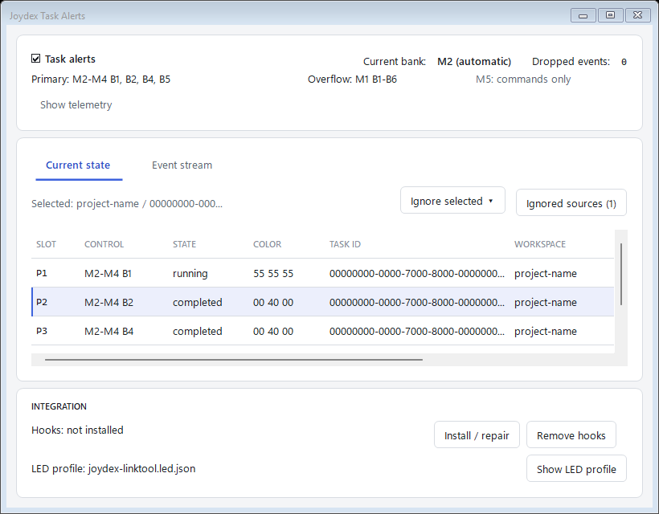

# Joydex task-status LED guide

Joydex uses the CM3 throttle buttons and the Constellation Alpha grip LED as a physical task monitor for Codex. Codex lifecycle hooks supply the task state, Joydex assigns that state to an available task button, and VIRPIL Controls LinkTool v3 keeps the matching LEDs lit.

## Set it up

1. Connect the CM3 throttle and Alpha grip, then start Joydex. Joydex writes `%LOCALAPPDATA%\Joydex\joydex-linktool.led.json` while both devices are available.
2. Open **Testing / Advanced > Task alerts status...** from the Joydex tray. Use **Show LED profile** to locate the generated file, then load it in LinkTool.
3. Start LinkTool's telemetry listener on its default UDP endpoint, `127.0.0.1:4123`.
4. In the same Joydex window, choose **Install / Repair hooks** and confirm the status reads `Hooks: installed`. If Codex marks the new handlers for review, open its Hooks screen and trust the Joydex handlers.
5. Make sure **Task alerts** is checked in the top level of the Joydex tray menu.
6. Submit a test prompt in Codex. Confirm that **Event stream** records it, **Current state** gains a running assignment, and the corresponding LED lights.

## What the lights mean

| State | Color | Meaning |
| --- | --- | --- |
| Running | Dim white/gray | Codex is working on the task |
| Needs attention | Yellow | Codex needs permission, a safety decision, or explicit input |
| Completed | Low green | The task stopped and is ready to acknowledge |
| Fault | Red | Reserved for a future fault source; current hooks do not create this state |

The throttle provides ten task slots:

| Page | Controls | Behavior |
| --- | --- | --- |
| M1 | B1-B6 | Overflow slots 5-10; empty buttons are dark |
| M2-M4 | B1, B2, B4, B5 | Primary slots 1-4; empty task positions are dark, while B3 and B6 keep their bank colors |
| M5 | B1-B6 | Ordinary commands only; medium-pink baseline and no task overlays |
| Alpha grip LED | Global | Highest-priority state across all ten slots |

Each new task claims the lowest free primary slot, then the lowest free overflow slot. When a primary position becomes empty, it remains dark for five seconds before the earliest M1 overflow task moves into it. The open primary position stays reserved during that pause so a newer task cannot jump the overflow queue. Remaining overflow tasks then slide forward in their existing order, keeping M1 compact. When all ten slots are occupied, later events are dropped; a later lifecycle event can claim a slot after one becomes available.

Joydex ignores lifecycle events that Codex marks with a subagent `agent_id`. It also ignores events without a persistent `transcript_path`, which covers Codex's internal ephemeral sessions. Delegated and background-only agent threads therefore do not claim their own slots; the parent sidebar task remains the physical unit of attention.

Pressing an assigned button opens its Codex task. Running and attention states stay assigned after navigation. Opening a completed task acknowledges it, clears the overlay, and returns that button to its normal binding. Blocked or failed navigation leaves the assignment alone.

## Restart and privacy behavior

Joydex saves active assignments, completion deadlines, and pending-attention counts in `%LOCALAPPDATA%\Joydex\task-alert-state.json`. Correlated attention is stored as SHA-256 keys. Prompt text, commands, patches, tool responses, and assistant messages are never written to this file.

Assignment state and queue order survive a Joydex restart. During restore, Joydex fills any primary gaps from overflow and compacts the remaining M1 queue. Running assignments expire after 12 hours; attention and terminal assignments expire after 24 hours. Invalid saved state is moved aside and Joydex starts with an empty pool. Turning **Task alerts** off clears the saved assignments.

## How LinkTool carries the state

Joydex sends one complete telemetry snapshot whenever a task state or physical mode changes. LinkTool evaluates the generated rules and holds the matching colors, so Joydex does not need to refresh the LEDs continuously. The generated baseline keeps primary task positions dark when empty, preserves the ordinary M2-M4 bank colors on B3 and B6, and paints all six M5 controls medium pink (`80 20 60` RGB).

The physical M1-M5 selector is read through VIRPIL's read-only Software Link feature report. Turning the dial updates the LinkTool page while preserving active task states. Joydex does not flash firmware, write EEPROM, calibrate either device, or edit a VPC profile.

If Joydex exits cleanly, it clears the live overlays before closing. If it crashes while an overlay is active, `Joydex.Guardian.exe` sends a final clear snapshot. The saved assignments remain available for the next Joydex start.

## Troubleshooting

Open **Testing / Advanced > Task alerts status...** before reinstalling or changing anything. It shows the detected bank, current assignments, dropped-event count, exact LinkTool telemetry, hook state, and the last 100 lifecycle events.

| Status or symptom | Check |
| --- | --- |
| `Hooks: repair needed` | Use **Install / Repair hooks** and verify the packaged relay path |
| `LinkTool inactive` | Start LinkTool and confirm its UDP listener is using port `4123` |
| `LinkTool update pending (VPC tool active)` | Close or release the VPC utility that currently owns the device |
| A light appeared late | Compare the event's receive time with the telemetry update; a missing event points to hook delivery, while a received event isolates the delay inside Joydex or LinkTool |
| The wrong LED page is visible | Check that **Current bank** reports the physical selector position as automatic |

## LEDs in use

Here, agents 1, 3, and 4 are done (green), while agent 2 is running (white). A task waiting on me would be yellow. The blue buttons are ordinary controls I use often: Plan mode and Submit.

## References

- [Codex lifecycle hooks](https://learn.chatgpt.com/docs/hooks)
- [Codex desktop deep links](https://learn.chatgpt.com/docs/reference/commands#deep-links)
- [VIRPIL VPC Software Suite and LED controls](https://support.virpil.com/en/support/solutions/articles/47001249267-vpc-software-suite)
- [Joydex LED implementation research archive](LED_STATUS_RESEARCH.md)
