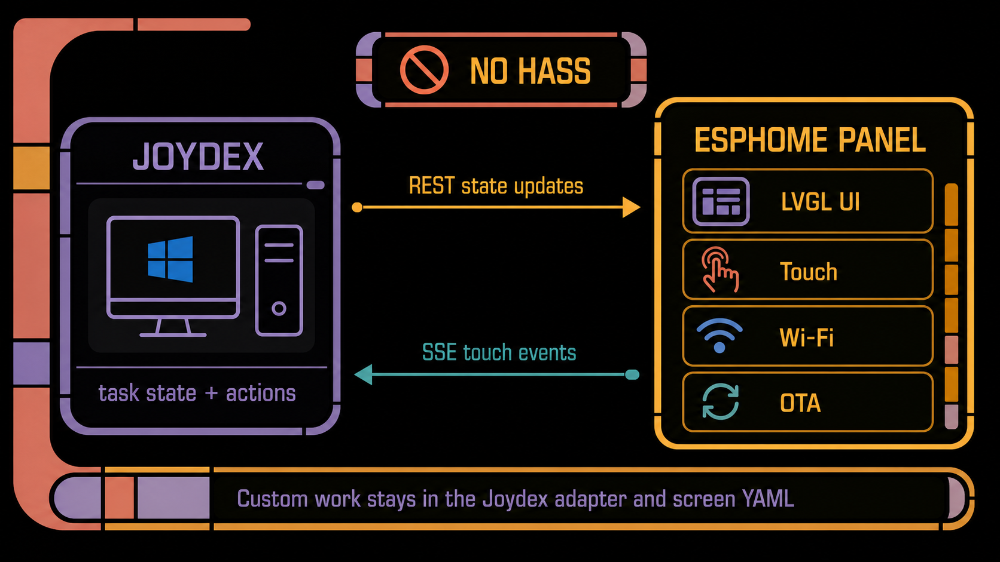

# Joydex wireless touchscreen research V1.1

> Public research record, updated July 27, 2026. The implementation is an
> experimental source example tested on one ESP32-4848S040C_I panel.

## Executive answer

The fastest useful route was to reuse **ESPHome + LVGL** and let the panel talk
directly to Joydex over the normal 2.4 GHz LAN.

That choice avoided custom ESP-IDF display firmware, a new embedded protocol, a
Windows web listener, Home Assistant, MQTT, and a separate runtime network.
Joydex only needed a small adapter that:

- projects its four primary task slots into four coarse display states;
- receives five fixed touch intents;
- invokes the existing task-navigation and semantic-action paths;
- reconnects and restores the complete visible state after an interruption.



## Decision: direct ESPHome Web Server API

The implemented path uses:

- the ESPHome `GUITION-4848S040` integrated display model;
- explicit sync timing already proven on the `C_I` variant;
- GT911 touch and LVGL;
- four task controls and one PLAN MODE control;
- Digest-authenticated REST state updates;
- Digest-authenticated Server-Sent Events for touch;
- USB for the first flash and password-protected ESPHome OTA afterward.

The panel makes no decisions about Codex tasks. Joydex remains authoritative
for task identity, state, navigation, safety policy, and Plan Mode.

## Architecture

```text
Codex lifecycle hooks
        |
        v
Joydex task-state pool -----> ESPHome REST selects -----> LVGL task cards
        ^                                                    |
        |                                                    v
Existing navigation/actions <----- authenticated SSE <--- touch controls
```

The panel joins the same trusted LAN as the Windows host. Joydex initiates
every connection to the panel, so no Windows listener, URL reservation, or
firewall exception is required.

## Tested hardware

The physical canary was purchased as an `ESP32-4848S040C_I`, described as a
4-inch 480×480 capacitive touchscreen:

- [Tested AliExpress listing](https://www.aliexpress.us/item/3256808028364930.html)
  (no affiliation; seller listings and board revisions can change).
- [GUITION specification](https://www.guition.com/ku/icms/upload/fb081940d6fc11f09850077a33e1404f/FTPData/UEditor/file/2026121/1768961092477/ESP32-4848S040%20Specifications-EN.pdf).
- [ESPHome board recipe](https://devices.esphome.io/devices/guition-esp32-s3-4848s040/).

The tested unit reported an ESP32-S3, 16 MiB flash, and 8 MiB octal PSRAM. Its
factory display and capacitive touch worked before flashing. Exact PCB
revision, optional relay population, and rear silkscreen were not recorded.

See the
[device reference](ESP32_4848S040C_I_DEVICE_REFERENCE.md) before adapting the
example to another production run.

## Screen contract

| Joydex meaning | ESPHome value | Visible treatment |
| --- | --- | --- |
| Empty slot | `EMPTY` | Blank gray task pad |
| Running | `RUNNING` | White fill, gray border, gray text |
| Waiting or attention | `ATTENTION` | Yellow fill, gray border, gray text |
| Completed | `COMPLETE` | Green fill, white text |
| Fault/error | `ATTENTION` | Same treatment as waiting |

Fault and approval currently share `ATTENTION`; Joydex has no separate red
panel state today.

The panel exposes these host-facing entities:

| Entity | Direction | Purpose |
| --- | --- | --- |
| `Task 1 State` … `Task 4 State` | Joydex → panel | Writable optimistic selects |
| `Task 1` … `Task 4` | Panel → Joydex | Momentary LVGL-backed binary sensors |
| `Sidebar` | Panel → Joydex | Legacy wire name for the visible PLAN MODE control |
| `/events` | Panel → Joydex | ESPHome SSE stream |

The host models the fifth intent as Plan Mode. The firmware retains `Sidebar`
and `sidebar_pressed` solely for compatibility with the deployed entity name.

## Touch and state findings

The physical test exposed three issues that were easy to miss in a browser
mockup:

1. **Pressed feedback must be local.** Waiting for the network round trip made
   taps feel lost. The touched LVGL control now contracts and gains a cyan
   border until release.
2. **Touch coordinates must be proven on the panel.** Early mappings could
   activate a neighboring control even though the layout looked correct.
3. **Redraw scope matters.** Resending all four selects for a one-card change
   caused visible tearing. Joydex now sends only changed slots during ordinary
   operation and reserves the four-slot replacement for reconnect recovery.

A task-state change can still produce a brief localized redraw on this
single-framebuffer display. The experimental acceptance boundary is no white
full-screen flash, sustained tearing, or incorrect action.

## REST and SSE findings

The standalone ESPHome Web Server path worked without Home Assistant:

```text
GET  /events
POST /select/Task%201%20State/set?option=RUNNING
```

Important behaviors:

- ESPHome sends state catch-up events after each SSE connection without a
  separate catch-up marker.
- Joydex suppresses the first state observed for each expected touch entity,
  then accepts live `OFF` to `ON` transitions.
- Joydex prefers the SSE `name_id` field and falls back to `id`.
- REST updates are serialized but not transactional.
- A failed changed-slot batch is retried against the same unconfirmed
  projection.
- Every SSE reconnect requests a complete current four-slot replacement.
- A 45-second idle timeout detects a silently dead event stream.
- Host actions are never replayed because state feedback failed.

The adapter owns no task identities. A task press resolves the current slot
assignment at press time and uses the existing deep-link navigator. PLAN MODE
uses the existing semantic action executor and its foreground/dry-run policy.

## Security boundary

The experimental configuration uses:

- Digest authentication on all Web Server requests;
- distinct ignored Wi-Fi, Web Server, and OTA secrets;
- Windows CurrentUser DPAPI for the host-side panel password;
- password-protected native ESPHome OTA;
- no web-based OTA handler;
- no Web Server log handler;
- no captive portal or fallback access point.

Digest avoids sending the password itself in plaintext, but HTTP traffic has
no TLS confidentiality or cryptographic server identity. The example is for a
trusted LAN only. Never expose or port-forward the panel.

Generated ESPHome state and compiled binaries can contain expanded runtime
credentials. `.esphome`, `secrets.yaml`, firmware artifacts, host
configuration, and whole-flash backups must remain ignored and private.

## Why not the alternatives?

| Alternative | Why it was deferred |
| --- | --- |
| Home Assistant | Adds a service Joydex does not otherwise need |
| MQTT | Adds a broker and another credential/lifecycle surface |
| Custom ESP-IDF protocol | Reimplements working display, touch, OTA, and network infrastructure |
| BLE runtime transport | Adds Windows pairing and reconnection work without helping the LAN use case |
| Windows-hosted web UI | Requires the ESP32 to become a browser and the PC to expose a listener |
| Encrypted ESPHome native API | Stronger transport, but no maintained .NET client was already in this project |

If this grows beyond a trusted-LAN experiment, encrypted transport and explicit
device enrollment should be reconsidered before adding more controls.

## Reusable implementation lessons

- Pin the ESPHome version and keep the known `C_I` timing overrides explicit.
- Treat a successful compile as necessary, not as physical display proof.
- Keep static decorative chrome separate from dynamic controls.
- Update only the control whose visible state changed.
- Make press acknowledgement independent of host/network latency.
- Reserve a stable DHCP address when Windows `.local` resolution is unreliable.
- Capture a separate complete factory backup for every physical panel.
- Never distribute compiled firmware built with real credentials.
- Keep the neutral skin as a simple rollback and comparison target.

## Current boundary

The public example supports four primary Joydex task slots and PLAN MODE on the
tested `ESP32-4848S040C_I` family. It does not claim:

- complete Codex sidebar visibility;
- support for every similarly named 4-inch ESP32 panel;
- Home Assistant integration;
- BLE control;
- TLS-protected panel traffic;
- tested factory restoration, power-loss rollback, or secure boot;
- generalized runtime theming.

Those are future decisions only if the experimental example proves useful to
more than one installation.
